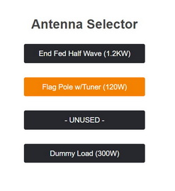

# Simple Antenna Selector
Remote antenna switch controller using ESP8266 for 4-port switch

Antenna is controlled using a web browser.  Supports one simultaneous user.

Web page is shown below with a Flag Pole Antenna selected.  Antenna labels can be easily changed in the code.

